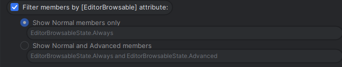

### Symxify C# Client

## PLEASE READ:

For the best expierience, ensure your editor has the EditorBrowsable state set to something among the lines of "Let the package decide". The Symxify client relies on EditorBrowsable to hide not-needed fields, such as the \*Specified fields.

### Quick start

To get started, clone this repo and navigate to the demo/net9 folder. There, you can see how to use the Symxify client with DI, and how to send requests.

## Featrures

### Modern dependency injection

Easily inject the client into your app by using modern .NET dependency injection

<code>builder.Services.AddSymxifyClient(options =>
builder.Configuration.GetSection("Symxify").Bind(options));</code>

### Fully featured intellisense

Every server and every operation will auto complete.

<pre><code>var resp = await _client.GetAccountSelectFields(new AccountSelectFieldsRequest()
{
    SelectableFields = new AccountSingleSelectableFields()
    {
        IncludeAllAccountFields = true
    },
    Credentials = new CredentialsChoice()
    {
        AdministrativeCredentials = new AdministrativeCredentials()
        {
            Password = "<PASSWORD>"
        }
    },
    AccountNumber = "99",
    DeviceInformation = new DeviceInformation()
    {
        DeviceNumber = 20548,
        DeviceType = "MYSYMX"
    },
    MessageId = "Getting this account!",
});</code></pre>

### Compatible with Managed Symxify and Self-hosted Symxify

To use this client with your existing managed Symxify instance, simply add the <code>SymxifyKey</code> object to your appsettings.json file

<pre><code>"Symxify": {
    "SymxifyUrl": "https://localhost:7036/api/v1/symxchange",
    "SymxifyKey": "<Your long secret key here>"
  }</code></pre>
